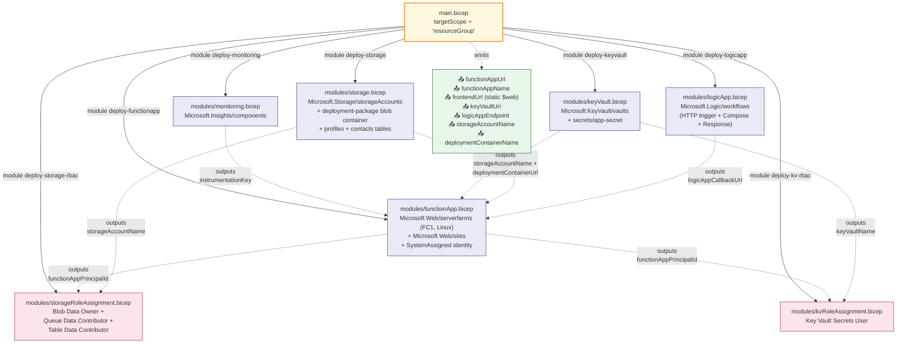
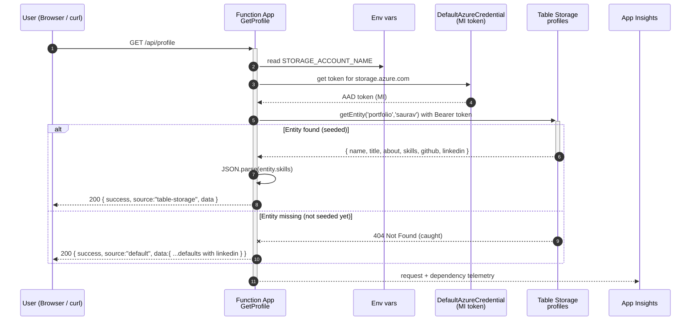
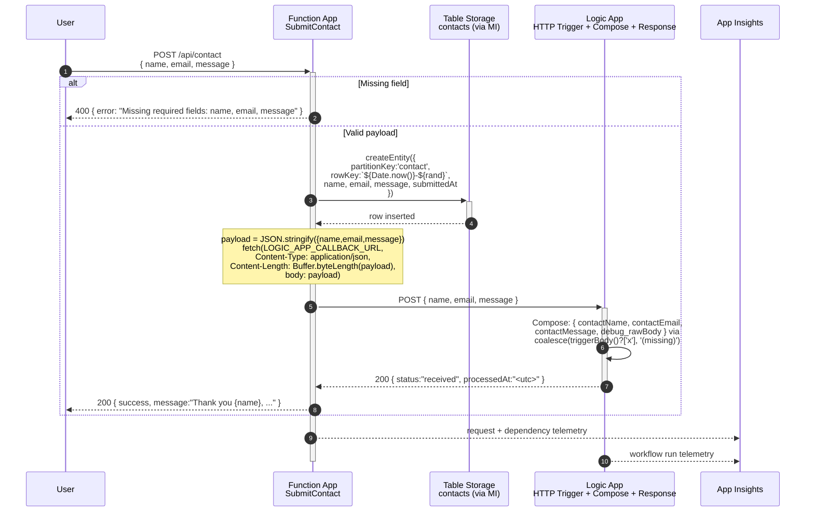
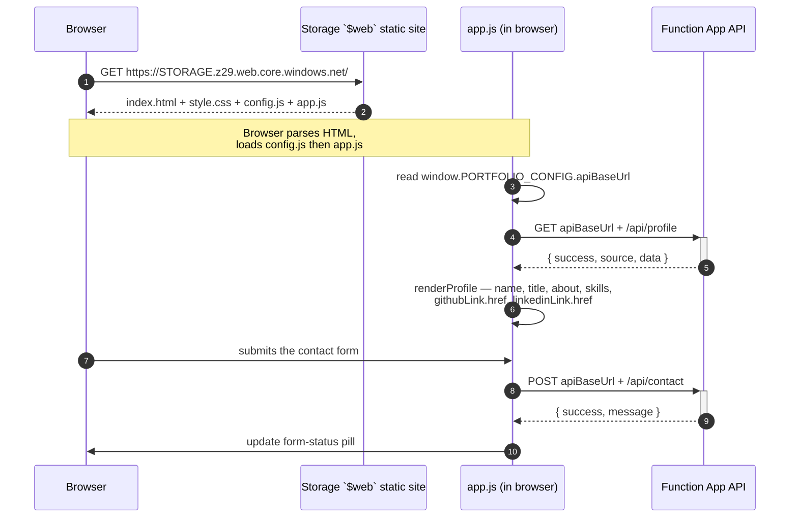
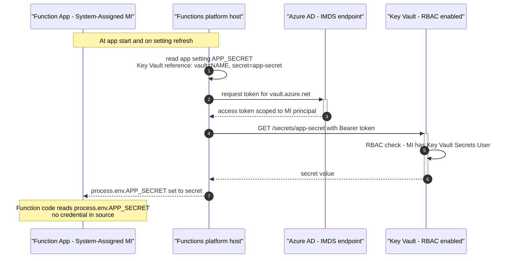
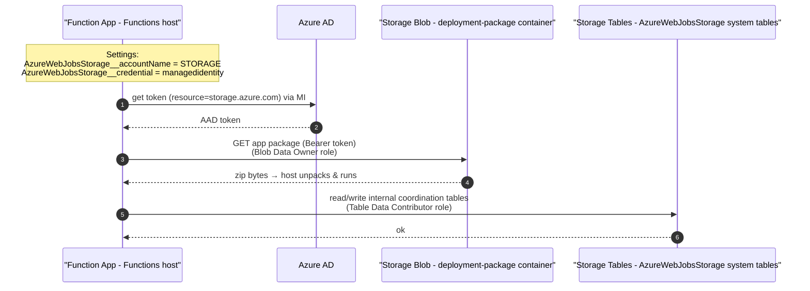

# Student Portfolio Platform — Azure Bicep IaC Project

> A beginner-friendly, end-to-end **serverless cloud project** on Microsoft Azure, built entirely with **Infrastructure as Code (Bicep)** and a handful of PowerShell scripts.
>
> Runs on Azure's cheapest / free tiers — total cost for a deploy → test → destroy cycle: **~$0.00** on the Azure for Students subscription.
>
> **Architecture highlight:** zero secrets at runtime. The Function App talks to Storage and Key Vault using its **Managed Identity** — there is no storage connection string, no storage key, no password anywhere in the running app.

---

## Table of contents

1. [What this project does](#what-this-project-does)
2. [Concepts in plain English](#concepts-in-plain-english)
3. [Architecture overview](#architecture-overview)
4. [Resources deployed](#resources-deployed)
5. [Repository layout](#repository-layout)
6. [Bicep module graph](#bicep-module-graph)
7. [Communication flows](#communication-flows)
8. [Deployment pipeline](#deployment-pipeline)
9. [Quick start](#quick-start)
10. [Testing](#testing)
11. [Destroy / cleanup](#destroy--cleanup)
12. [Why we migrated from Y1 Consumption to Flex Consumption](#why-we-migrated-from-y1-consumption-to-flex-consumption)
13. [Cost model](#cost-model)
14. [Troubleshooting](#troubleshooting)
15. [What you'll learn](#what-youll-learn)
16. [References](#references)

---

## What this project does

A tiny but complete cloud application for a personal portfolio website. Once deployed, you get:

- A **static portfolio site** served from Azure Storage's `$web` container (HTTPS, free).
- A **live HTTPS API** with two endpoints on Azure Functions:

| Endpoint | Method | What it does |
|---|---|---|
| `/api/profile` | `GET` | Returns your profile (name, title, about, skills, github, linkedin) as JSON. |
| `/api/contact` | `POST` | Accepts `{name, email, message}`, saves it to Table Storage, and notifies a Logic App workflow. |

The frontend calls both endpoints to render the portfolio and handle the contact form. No servers to manage, no VMs to patch.

**What this project teaches**

- **Infrastructure as Code (IaC)** — your Azure setup lives in Git as `.bicep` files.
- **Serverless compute** — Azure Functions on **Flex Consumption (FC1, Linux, Node 20)**.
- **NoSQL storage** — Azure Table Storage as a cheap, schemaless database.
- **Static website hosting** — frontend served straight from a Storage Account.
- **Managed identity** — zero-secret authentication between Azure services.
- **Key Vault references** — secrets resolved at runtime via MI, never in source.
- **Workflow automation** — Logic App (Consumption) as a low-code notifier.
- **Observability** — Application Insights collects logs and metrics automatically.
- **One-click deploy/destroy** — hardened PowerShell scripts.

---

## Concepts in plain English

| Term | Plain-English meaning |
|---|---|
| **Cloud** | Someone else's computers (Microsoft's, here) you rent by the second. |
| **Resource Group** | A folder in Azure that holds everything for one project. Delete folder → delete everything → bill stops. |
| **Bicep** | A friendly language to describe Azure resources. You write what you want, Azure makes it real. |
| **IaC** | Your cloud setup is a file in Git, not a memory of clicks. Reproducible and versioned. |
| **Serverless** | You write functions; the cloud runs them on demand. No servers to manage. |
| **Flex Consumption (FC1)** | The newest serverless Functions plan: Linux only, scales to zero, supports identity-based storage and per-instance memory tuning. |
| **Azure Function** | A small piece of Node.js (here) that runs in response to an HTTP request. |
| **Table Storage** | A super-cheap NoSQL key/value store. "Rows with a partition key + row key." |
| **Key Vault** | A secure safe for secrets (passwords, API keys). |
| **Managed Identity (MI)** | An Azure-provided identity for your app, so it can talk to other Azure services **without a password**. Azure handles the auth. |
| **RBAC** | Role-Based Access Control. You grant the MI roles like *Storage Table Data Contributor* and *Key Vault Secrets User* to allow exactly the actions it needs. |
| **Logic App** | A visual/JSON-defined workflow. "When X happens, do Y, then Z." |
| **Application Insights** | Auto-collects logs, errors, response times, requests from your app. |
| **Static Website (`$web`)** | A special blob container that serves files directly over HTTPS like a CDN — no web server needed. |

---

## Architecture overview

```mermaid
flowchart TB
    subgraph Client["Client"]
        Browser["Browser / curl / Postman"]
    end

    subgraph Azure["Azure Resource Group: rg-portfolio-dev (Central India)"]
        direction TB

        subgraph Frontend["Frontend hosting"]
            Web["Storage &dollar;web container<br/>https://STORAGE.z29.web.core.windows.net"]
            Static["index.html · app.js · style.css · config.js"]
            Web --- Static
        end

        subgraph Compute["Serverless compute"]
            Plan["Flex Consumption plan (FC1, Linux)"]
            Func["Function App (Node 20)<br/>System-Assigned Managed Identity<br/>GET /api/profile · POST /api/contact"]
            Func -. hosted on .-> Plan
        end

        subgraph Storage["Storage Account (one account, three roles)"]
            St["StorageV2 · Standard_LRS · TLS 1.2 · HTTPS only"]
            DepCt["blob container: deployment-package<br/>(Flex one-deploy app package)"]
            WebCt["blob container: &dollar;web<br/>(static frontend)"]
            TProfiles["table: profiles<br/>PK=portfolio · RK=saurav"]
            TContacts["table: contacts<br/>PK=contact · RK=ts-rand"]
            St --> DepCt
            St --> WebCt
            St --> TProfiles
            St --> TContacts
        end

        subgraph Secrets["Secrets"]
            KV["Key Vault (RBAC, soft-delete 7d)"]
            Sec["secret: app-secret"]
            KV --> Sec
        end

        subgraph Workflow["Workflow"]
            Logic["Logic App (Consumption)<br/>HTTP trigger → Compose → 200 Response"]
        end

        subgraph Obs["Observability"]
            AI["Application Insights"]
        end
    end

    Browser -->|GET index.html| Web
    Browser -->|fetch /api/profile · POST /api/contact| Func
    Web -. serves JS that calls .-> Func

    Func -->|DefaultAzureCredential<br/>Table Data Contributor| TProfiles
    Func -->|DefaultAzureCredential<br/>Table Data Contributor| TContacts
    Func -->|AzureWebJobsStorage__credential=managedidentity<br/>Blob Data Owner| DepCt
    Func -->|POST JSON<br/>LOGIC_APP_CALLBACK_URL| Logic
    Func -->|KeyVault reference<br/>Secrets User role| KV
    Func -->|APPINSIGHTS_INSTRUMENTATIONKEY| AI

    classDef client fill:#e3f2fd,stroke:#1565c0
    classDef compute fill:#fff3e0,stroke:#e65100
    classDef data fill:#e8f5e9,stroke:#2e7d32
    classDef secret fill:#fce4ec,stroke:#ad1457
    classDef workflow fill:#f3e5f5,stroke:#6a1b9a
    classDef monitor fill:#ede7f6,stroke:#4527a0
    classDef frontend fill:#e0f7fa,stroke:#00838f
    class Browser client
    class Func,Plan compute
    class St,DepCt,WebCt,TProfiles,TContacts data
    class KV,Sec secret
    class Logic workflow
    class AI monitor
    class Web,Static frontend
```



The **same Storage Account** holds three things:

1. The Flex Consumption **app package** (`deployment-package` blob container).
2. The **static frontend** (`$web` blob container).
3. The **NoSQL data** (`profiles` + `contacts` tables).

The Function App accesses all three using its Managed Identity — no shared keys, no connection strings.

---

## Resources deployed

All resources live inside one resource group (default `rg-portfolio-dev`) in **Central India**.

### 1. Storage Account — *the database, the static host, and the app-package store*

- **What:** General-purpose v2 Storage Account (`Standard_LRS`, TLS 1.2 minimum, HTTPS only).
- **Holds:** `profiles` table (your portfolio data), `contacts` table (form submissions), `deployment-package` blob container (the Function App's deployed zip), and `$web` blob container (the frontend).
- **Why one account:** cheapest possible design; one identity, one set of RBAC roles, one bill line.
- **Cost:** ~$0.01/month at hobby scale.
- **Defined in:** [modules/storage.bicep](modules/storage.bicep)

### 2. Azure Functions (Flex Consumption, FC1) — *the API*

- **What:** Linux Node 20 app exposing `GET /api/profile` and `POST /api/contact`.
- **Plan:** Flex Consumption `FC1`. Scales 0 → many. Per-instance 2 GB memory, max 100 instances.
- **Identity:** System-assigned Managed Identity. The app's principal ID is granted three storage roles + one Key Vault role.
- **Storage binding:** identity-based — `AzureWebJobsStorage__accountName` + `AzureWebJobsStorage__credential=managedidentity`. **No `AzureWebJobsStorage` connection string anywhere.**
- **Deployment model:** Flex "one deploy" — zip is uploaded to the `deployment-package` blob container, which the runtime pulls via the same MI.
- **Cost:** Free for the first 1 million executions/month.
- **Defined in:** [modules/functionApp.bicep](modules/functionApp.bicep)

### 3. Key Vault — *the safe*

- **What:** RBAC-enabled vault holding a single demo secret `app-secret` (set at deploy time, prompted by `deploy.ps1`).
- **Why:** demonstrates Azure's production pattern of keeping secrets out of code. The Function App reads it via `APP_SECRET = @Microsoft.KeyVault(VaultName=...;SecretName=app-secret)` — resolved at startup by the platform using the MI.
- **Soft-delete:** 7 days retention (configured in [modules/keyVault.bicep](modules/keyVault.bicep)). `deploy.ps1` purges leftover soft-deleted vaults before each deploy so re-runs don't hit `ConflictError`.
- **Cost:** free for basic operations.
- **Defined in:** [modules/keyVault.bicep](modules/keyVault.bicep)

### 4. Logic App (Consumption) — *the notifier*

- **What:** HTTP-triggered workflow with a JSON schema for `{name, email, message}`. Two actions:
  1. `Log_Contact_Received` (Compose) — uses `coalesce(triggerBody()?['name'], '(missing)')`-style safe-navigation plus a `debug_rawBody` field so you can inspect the exact payload that arrived.
  2. `Response` — returns `200 { status: "received", processedAt: "<utc>" }`.
- **Wiring:** the workflow's callback URL is produced by `listCallbackUrl()` at deploy time and passed into the Function App as `LOGIC_APP_CALLBACK_URL`.
- **Cost:** free for ~4,000 actions/month.
- **Defined in:** [modules/logicApp.bicep](modules/logicApp.bicep)

### 5. Application Insights — *the camera*

- **What:** captures logs, exceptions, request rates, dependencies. 30-day retention.
- **Cost:** free for the first 5 GB/month.
- **Defined in:** [modules/monitoring.bicep](modules/monitoring.bicep)

### 6. RBAC role assignments — *the trust*

These are why no secrets are needed at runtime:

| Module | Role | Scope |
|---|---|---|
| [modules/storageRoleAssignment.bicep](modules/storageRoleAssignment.bicep) | Storage Blob Data Owner | Storage Account |
| [modules/storageRoleAssignment.bicep](modules/storageRoleAssignment.bicep) | Storage Queue Data Contributor | Storage Account |
| [modules/storageRoleAssignment.bicep](modules/storageRoleAssignment.bicep) | Storage Table Data Contributor | Storage Account |
| [modules/kvRoleAssignment.bicep](modules/kvRoleAssignment.bicep) | Key Vault Secrets User | Key Vault |

All four are bound to the Function App's MI principal ID. Role assignment names use `guid(scope, principal, role)` so re-deploys are idempotent.

**Total cost for deploy → test → destroy: ~$0.00.**

---

## Repository layout

```
Portfolio-project/
├── main.bicep                          # Root orchestrator — wires the 7 modules together
├── deploy.ps1                          # Hardened one-click deploy
├── destroy.ps1                         # One-click cleanup (deletes the resource group)
├── azure-for-students-plan.md          # Offer details and credit-saving tips
├── README.md                           # ← you are here
├── modules/
│   ├── storage.bicep                   # Storage v2 + tables (profiles, contacts) + deployment-package container
│   ├── functionApp.bicep               # FC1 plan + Function App + MI + identity-based AzureWebJobsStorage
│   ├── keyVault.bicep                  # KV (RBAC, 7d soft-delete) + app-secret
│   ├── logicApp.bicep                  # Consumption Logic App: HTTP trigger + Compose + Response
│   ├── monitoring.bicep                # Application Insights component
│   ├── storageRoleAssignment.bicep     # MI → Blob Owner + Queue Contributor + Table Contributor on storage
│   └── kvRoleAssignment.bicep          # MI → Secrets User on Key Vault
├── parameters/
│   └── dev.bicepparam                  # Reference parameter file (deploy.ps1 passes params inline)
├── src/
│   ├── api/                            # Node 20 Azure Functions app
│   │   ├── host.json                   # Runtime v4 config + App Insights sampling
│   │   ├── package.json                # @azure/data-tables ^13 + @azure/identity ^4
│   │   ├── GetProfile/
│   │   │   ├── function.json           # HTTP trigger: GET /api/profile, anonymous
│   │   │   └── index.js                # TableClient + DefaultAzureCredential, fallback to default profile
│   │   └── SubmitContact/
│   │       ├── function.json           # HTTP trigger: POST /api/contact, anonymous
│   │       └── index.js                # Validates → writes to contacts table → POSTs to Logic App
│   └── frontend/                       # Static portfolio site (served from $web)
│       ├── index.html                  # Hero (GitHub + LinkedIn links) + 2 panels
│       ├── style.css                   # Responsive design
│       ├── app.js                      # fetch profile, render skills, POST contact
│       └── config.js                   # Placeholder — overwritten by deploy.ps1
└── scripts/
    ├── seed-profile.ps1                # Inserts portfolio/saurav into the profiles table
    └── smoke-test.ps1                  # End-to-end live deployment check
```

### File-by-file one-liners

| File | One-liner |
|---|---|
| [main.bicep](main.bicep) | Generates unique names from `uniqueString(resourceGroup().id)`, deploys 7 modules, threads outputs (Storage → Function, Logic → Function, KV → Function, Monitoring → Function), grants MI roles. |
| [modules/storage.bicep](modules/storage.bicep) | Storage v2 + `deployment-package` blob container + `tableServices/default` + `profiles` and `contacts` tables. Outputs only endpoints and names — **no keys**. |
| [modules/functionApp.bicep](modules/functionApp.bicep) | FC1 Linux plan + Function App with SystemAssigned MI, `functionAppConfig.deployment.storage` = blob container + MI auth, app settings include identity-based `AzureWebJobsStorage__*`, Key Vault reference for `APP_SECRET`, CORS for `localhost:3000` + portal. |
| [modules/keyVault.bicep](modules/keyVault.bicep) | RBAC-enabled vault + the demo `app-secret`. |
| [modules/logicApp.bicep](modules/logicApp.bicep) | Inline workflow definition: HTTP trigger with JSON schema → Compose with safe-navigation + `debug_rawBody` → 200 Response. Outputs `logicAppCallbackUrl`. |
| [modules/monitoring.bicep](modules/monitoring.bicep) | App Insights component (web, 30d retention). Outputs instrumentation key. |
| [modules/storageRoleAssignment.bicep](modules/storageRoleAssignment.bicep) | Three `Microsoft.Authorization/roleAssignments` against the storage account: Blob Data Owner, Queue Data Contributor, Table Data Contributor. |
| [modules/kvRoleAssignment.bicep](modules/kvRoleAssignment.bicep) | One role assignment: Key Vault Secrets User against the vault. |
| [src/api/host.json](src/api/host.json) | Functions runtime v4 + extension bundle + App Insights sampling. |
| [src/api/package.json](src/api/package.json) | Runtime deps: `@azure/data-tables`, `@azure/identity`. |
| [src/api/GetProfile/index.js](src/api/GetProfile/index.js) | `new TableClient(\`https://${STORAGE_ACCOUNT_NAME}.table.core.windows.net\`, 'profiles', new DefaultAzureCredential())` → `getEntity('portfolio','saurav')`; on miss, return default profile with `source:"default"`. |
| [src/api/SubmitContact/index.js](src/api/SubmitContact/index.js) | Validates body → `createEntity` in `contacts` (DefaultAzureCredential) → `fetch(LOGIC_APP_CALLBACK_URL, …)` with explicit `Content-Length` → 200. |
| [src/frontend/index.html](src/frontend/index.html) | Hero with `#github-link` + `#linkedin-link`, skills panel, contact form. Loads `config.js` then `app.js`. |
| [src/frontend/app.js](src/frontend/app.js) | On load → `GET /api/profile`, render name/title/skills/github/linkedin; on submit → `POST /api/contact`. |
| [src/frontend/config.js](src/frontend/config.js) | Holds `window.PORTFOLIO_CONFIG.apiBaseUrl` — regenerated by `deploy.ps1`. |
| [src/frontend/style.css](src/frontend/style.css) | Responsive glassmorphism look. |
| [deploy.ps1](deploy.ps1) | Hardened 6-stage pipeline (KV purge → Bicep → SCM-wait + zip-deploy with retries → static-website enable retries + frontend upload retries → seed). |
| [destroy.ps1](destroy.ps1) | `az group delete --yes --no-wait` after a `yes` prompt. |
| [scripts/seed-profile.ps1](scripts/seed-profile.ps1) | Pulls a storage key, ensures the `profiles` table, upserts `portfolio/saurav` with GitHub + LinkedIn URLs. |
| [scripts/smoke-test.ps1](scripts/smoke-test.ps1) | End-to-end live check (RG state, app settings, table exists, GET 200 from table, POST 200 + persisted, 400 on invalid). |

---

## Bicep module graph

How `main.bicep` orchestrates the modules and threads their outputs.



> Bicep figures out the deploy order automatically from the `params:` block: Storage / KV / Monitoring / Logic App deploy first; the Function App depends on all four; the two RBAC modules depend on the Function App (for its `principalId`).

---

## Communication flows

### 1. `GET /api/profile` — read flow



> The fallback means the API stays green even before the seed step runs. Tell them apart by the `source` field.

### 2. `POST /api/contact` — write + notify flow



> **Why `fetch()` + explicit `Content-Length`?** Older `https.request()` streams the body with **chunked transfer encoding** (no `Content-Length`). The Logic App HTTP trigger doesn't parse chunked bodies as JSON, so `triggerBody()` returns `null` and Compose expressions fail. Setting `Content-Length: Buffer.byteLength(payload)` makes it a content-length-terminated POST that Logic Apps parses correctly. Inspect `debug_rawBody` in the latest Logic App run — it should contain the literal JSON string.

### 3. Frontend → API flow



> CORS: [modules/functionApp.bicep](modules/functionApp.bicep) seeds `allowedOrigins` with `portal.azure.com` + `localhost:3000`; `deploy.ps1` appends the live `$web` URL via `az functionapp cors add`.

### 4. Key Vault reference resolution (startup / refresh)

How the Function App reads `app-secret` from Key Vault **without ever seeing a password**.



> The required `Key Vault Secrets User` role is granted by [modules/kvRoleAssignment.bicep](modules/kvRoleAssignment.bicep). If `process.env.APP_SECRET` ever resolves to the literal `@Microsoft.KeyVault(...)` string in your Function logs, the role assignment didn't apply.

### 5. Identity-based `AzureWebJobsStorage` (Flex Consumption runtime)



> The same MI + the same RBAC roles cover both the user-code data path (your `profiles` / `contacts` table reads/writes) and the platform's internal `AzureWebJobsStorage` traffic. There is **no `AzureWebJobsStorage` connection-string app setting** in this project.

---

## Deployment pipeline

`deploy.ps1` is a hardened 6-stage pipeline. Each stage is idempotent. The script aborts with `exit 1` on a real failure (no more silent half-deploys).

```mermaid
flowchart LR
    Dev["Developer<br/>(PowerShell)"] -->|".\deploy.ps1"| Script

    subgraph Script["deploy.ps1"]
        direction TB
        S1["[1/6] az group create"]
        S1a["[1a/6] Purge soft-deleted<br/>Key Vaults matching portfolio*<br/>(prevents ConflictError)"]
        S2["[2/6] az deployment group create<br/>main.bicep + appSecret prompt"]
        S3["[3/6] Capture outputs"]
        S4["[4/6] Wait for SCM site<br/>→ zip src/api<br/>→ config-zip --build-remote true<br/>(3× retry on failure)"]
        S5["[5/6] Enable &dollar;web (retry until enabled)<br/>→ poll &dollar;web container<br/>→ generate config.js<br/>→ upload-batch (3× retry)<br/>→ CORS allowlist &dollar;web URL"]
        S6["[6/6] scripts/seed-profile.ps1<br/>upserts portfolio/saurav"]
        S1 --> S1a --> S2 --> S3 --> S4 --> S5 --> S6
    end

    S2 -->|ARM| Bicep
    subgraph Bicep["main.bicep modules (deploy in parallel where possible)"]
        M1["monitoring"]
        M2["keyVault"]
        M3["storage"]
        M5["logicApp"]
        M4["functionApp<br/>(depends on 1-3 + 5)"]
        Rs["storageRoleAssignment<br/>(depends on 4)"]
        Rk["kvRoleAssignment<br/>(depends on 4)"]
        M3 --> M4
        M2 --> M4
        M1 --> M4
        M5 --> M4
        M4 --> Rs
        M4 --> Rk
    end

    Bicep --> Azure["Azure rg-portfolio-dev"]
    S4 -->|zip via SCM/Oryx| Azure
    S5 -->|blob REST| Azure
    S6 -->|Table REST API| Azure
    Azure -->|live URLs| Dev

    classDef stage fill:#fff3e0,stroke:#e65100
    classDef bicep fill:#e8eaf6,stroke:#283593
    classDef cloud fill:#e0f7fa,stroke:#006064
    class S1,S1a,S2,S3,S4,S5,S6 stage
    class M1,M2,M3,M4,M5,Rs,Rk bicep
    class Azure cloud
```



### Stage details

| # | Stage | What actually happens |
|---|---|---|
| 1 | RG create | `az group create -n rg-portfolio-dev -l centralindia` |
| 1a | **KV purge** | Lists `az keyvault list-deleted` for names matching `portfolio*` in the location; purges each with `--no-wait`; polls until none remain. **Prevents `ConflictError` on redeploy.** |
| 1.5 | Y1 cleanup | If an old Y1 Consumption plan/function exists from a previous deployment, delete it (plan SKU can't be changed in place). No-op for clean deploys. |
| 2 | Bicep deploy | `az deployment group create --template-file main.bicep --parameters projectName=portfolio appSecret=<prompted>` |
| 3 | Capture outputs | Parses `functionAppUrl`, `functionAppName`, `frontendUrl`, `keyVaultUri`, `logicAppEndpoint`, `storageAccountName`. |
| 4 | **Function code deploy** | Zips `src/api/*`. Polls `https://<func>.scm.azurewebsites.net` (HEAD, up to 5 min) until ready. Runs `az functionapp deployment source config-zip --src <zip> --build-remote true` with up to 3 retries (30 s backoff). Aborts on failure. |
| 5 | **Frontend publish** | Calls `az storage blob service-properties update --static-website` in a retry-until-enabled loop (data-plane is cold on brand-new accounts). Polls `az storage container exists --name $web`. Generates `config.js` with `apiBaseUrl = funcUrl`. `az storage blob upload-batch` with up to 3 retries. Appends the static-site URL to the Function App's CORS list. |
| 6 | Seed profile | `scripts/seed-profile.ps1 -ResourceGroup -StorageAccount -FunctionApp` pulls a key, ensures the `profiles` table, upserts the `portfolio/saurav` entity (skills, GitHub, LinkedIn). Then `GET /api/profile` to prove it works. |

### Why all the retries?

Three Azure data-plane endpoints lag behind ARM:

1. **Function App SCM site** (`<func>.scm.azurewebsites.net`) takes ~30–60 s after Bicep finishes before it accepts zip uploads — first attempt is often a 404 HTML page.
2. **Storage blob data-plane** on a brand-new account silently no-ops the `--static-website` toggle for 30–60 s; the script verifies `staticWebsite.enabled == true` before continuing.
3. **`$web` container** is created lazily a few seconds *after* the toggle succeeds, so the upload would race and fail with `ContainerNotFound`.

The previous version of the script hit all three races. The current version polls each one and retries the operation up to 3× before aborting.

---

## Quick start

### Prerequisites

- **Azure CLI** (`az --version`) and logged in (`az login`)
- An **Azure subscription** (Azure for Students works perfectly)
- **PowerShell 5.1+** (Windows) — used by all the scripts
- *(Optional)* Node.js 20 + Azure Functions Core Tools — only for **local** Function App development. Not needed for cloud deploy.

### Deploy

```powershell
cd Portfolio-project
.\deploy.ps1
```

You'll be prompted for an app secret (any string — stored in Key Vault). Then the script will:

1. Create the resource group
2. Purge any soft-deleted Key Vaults that would block Bicep
3. Deploy all 7 Bicep modules (~2–3 min)
4. Wait for the Function App SCM endpoint, then publish the zipped Node code (`npm install` runs remotely on the host)
5. Enable static-site hosting (with retry), upload the frontend with a generated `config.js`, add the static URL to CORS
6. Seed your portfolio data and verify `GET /api/profile`

If everything works, you'll see "Frontend published" + "Seed complete" + the two URLs printed at the end.

### Deploy to a different resource group

All scripts take `-ResourceGroup` as a parameter, defaulting to `rg-portfolio-dev`:

```powershell
.\deploy.ps1       -ResourceGroup rg-portfolio-test
.\destroy.ps1      -ResourceGroup rg-portfolio-test
```

Resource names inside Bicep use `uniqueString(resourceGroup().id)` so different RGs produce different names — no collisions with a previous deployment.

### Quick re-publish only the function code

```powershell
$az='C:\Program Files\Microsoft SDKs\Azure\CLI2\wbin\az.cmd'
$zip = Join-Path $env:TEMP 'api.zip'; Remove-Item $zip -ErrorAction SilentlyContinue
Compress-Archive .\src\api\* $zip -Force
& $az functionapp deployment source config-zip -g rg-portfolio-dev -n <function-app-name> --src $zip --build-remote true
```

---

## Testing

### Manual smoke test

Replace `<function-app-name>` with the name printed by `deploy.ps1` (e.g., `portfolio-func-svbzwtaqldjri`).

```powershell
# Read
curl https://<function-app-name>.azurewebsites.net/api/profile

# Write
curl -X POST https://<function-app-name>.azurewebsites.net/api/contact `
  -H "Content-Type: application/json" `
  -d '{"name":"Test User","email":"test@example.com","message":"Hello!"}'
```

**Sample `GET /api/profile` response (after seeding):**

```json
{
  "success": true,
  "source": "table-storage",
  "data": {
    "name": "Saurav Ganguly",
    "title": "Cloud Engineering Student",
    "about": "Learning cloud infrastructure with Azure for Students. Building serverless APIs and managing IaC with Bicep.",
    "skills": ["Azure","Bicep","IaC","DevOps","Python","Node.js"],
    "github": "https://github.com/ganguly298",
    "linkedin": "https://www.linkedin.com/in/saurav-ganguly-8b1542279"
  }
}
```

**Sample `POST /api/contact` response:**

```json
{ "success": true, "message": "Thank you Test User, your message has been received!" }
```

### Automated smoke test

```powershell
.\scripts\smoke-test.ps1
```

Checks RG state, app settings, table existence, the seeded profile entity, `GET 200 + source=table-storage`, `POST 200 + row persisted`, and the `400` path. Exit code = number of failed checks.

---

## Destroy / cleanup

```powershell
.\destroy.ps1
```

Prompts for `yes`, then `az group delete --yes --no-wait`. Resources are gone in 2–5 minutes and **all charges stop**.

> ⚠️ Key Vault names are soft-deleted for **7 days** in this project (configured in [modules/keyVault.bicep](modules/keyVault.bicep)). The next `deploy.ps1` handles this automatically: stage **1a** purges any soft-deleted `portfolio*` vault in the same region before Bicep runs.

---

## Why we migrated from Y1 Consumption to Flex Consumption

The original implementation used **Y1 Consumption** Functions with an `AzureWebJobsStorage` connection string. That meant:

- **The storage account key was an app setting** on the Function App.
- **Rotating the storage key** (security best practice / required after any key leak) broke the Function App until you manually updated the setting.

Migrating to **Flex Consumption (FC1)** unlocked:

- **Identity-based `AzureWebJobsStorage`** via `AzureWebJobsStorage__credential=managedidentity` — no key on the Function App.
- **App package pulled via MI** from the `deployment-package` blob container — no key for deployment either.
- **`DefaultAzureCredential` in user code** (`GetProfile`, `SubmitContact`) — no `TABLE_STORAGE_CONNECTION` setting.
- **Storage key rotation now a no-op.** Verified: rotating `key1` mid-test → `GET /api/profile` continued returning `HTTP 200` with zero downtime, zero restarts, zero config changes.

You can verify it yourself:

```powershell
$az = 'C:\Program Files\Microsoft SDKs\Azure\CLI2\wbin\az.cmd'
$rg = 'rg-portfolio-dev'; $sa = '<storage-account>'; $fn = '<function-app>'
& $az storage account keys renew -g $rg -n $sa --key key1 --output none
curl.exe -s -o nul -w "HTTP %{http_code}`n" "https://$fn.azurewebsites.net/api/profile"
# Expect: HTTP 200
```

---

## Cost model

| Scenario | Cost |
|---|---|
| Deploy + test + destroy in one sitting | ~$0.00 |
| Idle for a week with no traffic | ~$0.01 |
| 1,000 API calls in a day | ~$0.00 (well within free tiers) |
| 10,000 contact-form submissions/month | ~$0.00 (Functions FC1 + Table writes + Logic App free tiers) |

> The Azure for Students subscription gives you **$100 in free credit** for 12 months and doesn't require a credit card. See [azure-for-students-plan.md](azure-for-students-plan.md) for the breakdown.

---

## Troubleshooting

| Symptom | Likely cause / fix |
|---|---|
| `deploy.ps1` errors "Please run 'az login'" | Run `az login`, then re-run the script. |
| Bicep fails with `ConflictError: A vault with the same name already exists in deleted state` | Stage **1a** of `deploy.ps1` purges soft-deleted vaults automatically. If you bypassed it, run `az keyvault list-deleted` + `az keyvault purge --name <name>` manually. |
| Function deploy attempt 1 returns a 404 HTML page | Normal Flex SCM warm-up race. The hardened script polls the SCM endpoint and retries up to 3×. |
| `GET /api/profile` returns `"source":"default"` | Seed step didn't run (or the row was deleted). Re-run `scripts\seed-profile.ps1 -ResourceGroup <rg> -StorageAccount <sa> -FunctionApp <fn>`. |
| Frontend page shows the old broken state | **Browser cache.** Hard-reload (Ctrl+Shift+R) or open in an Incognito window. The site is served via Storage's static-website endpoint, which honors browser caching headers. |
| `POST /api/contact` works but Logic App run shows fields as `(missing)` | The Function App is sending the body with chunked transfer encoding instead of a fixed `Content-Length` header, so `triggerBody()` is `null`. The current code uses `fetch()` with explicit `Content-Length: Buffer.byteLength(payload)`. Inspect `debug_rawBody` in the Compose action — it should contain the literal JSON. |
| `process.env.APP_SECRET` resolves to the literal `@Microsoft.KeyVault(...)` string | The MI is missing the `Key Vault Secrets User` role. Verify [modules/kvRoleAssignment.bicep](modules/kvRoleAssignment.bicep) deployed successfully. |
| Function App returns 500 / Table-Storage errors mentioning auth | The MI is missing the storage RBAC roles. Verify [modules/storageRoleAssignment.bicep](modules/storageRoleAssignment.bicep) deployed. Note: role propagation can lag ~30 s after deployment. |
| `--static-website` enable appears to no-op | Brand-new storage account data-plane is cold. The hardened script retries the enable until `staticWebsite.enabled == true`. |
| `$web` container `ContainerNotFound` on upload | The container is created lazily a few seconds after the static-website toggle. The hardened script polls until it exists. |
| Smoke test fails on "Contact row persisted" | Table writes are eventually consistent; the test waits ~3 s. Re-run if you see a transient miss. |
| `az` CLI not on `PATH` inside scripts | Scripts use the Windows install path `C:\Program Files\Microsoft SDKs\Azure\CLI2\wbin\az.cmd`. Edit the `$az` variable in `deploy.ps1` / `scripts/*.ps1` if yours differs. |

---

## What you'll learn

By deploying, testing, and destroying this project once, you'll get hands-on experience with:

- Writing and deploying **Bicep modules** that compose a real multi-service app
- Threading **module outputs** between modules without naming gymnastics
- **Flex Consumption** Functions (FC1) with **identity-based `AzureWebJobsStorage`**
- **`DefaultAzureCredential`** in Node.js for keyless Storage access
- **Granting RBAC roles** to a Managed Identity in Bicep using `guid(...)` for idempotency
- **Key Vault references** in app settings, resolved by the platform via MI
- A simple **NoSQL data model** in Azure Table Storage (partition key + row key)
- Building a small **HTTP-triggered Logic App workflow** with a JSON schema and safe-navigation expressions
- The **Logic App content-length gotcha** (chunked transfer breaks `triggerBody()`)
- Hosting a **static frontend** on Storage `$web` with HTTPS for free
- Configuring **CORS** between a static site and a Function App
- Reading **logs and exceptions** in Application Insights
- Writing **idempotent, race-aware deployment scripts** that retry around Azure data-plane warm-up
- **Storage key rotation as a non-event** thanks to identity-based access
- **Cost-aware** cloud development on a student budget

---

## References

- [Bicep documentation](https://learn.microsoft.com/azure/azure-resource-manager/bicep/)
- [Azure Functions — Flex Consumption plan](https://learn.microsoft.com/azure/azure-functions/flex-consumption-plan)
- [Azure Functions — identity-based connections](https://learn.microsoft.com/azure/azure-functions/functions-reference#configure-an-identity-based-connection)
- [`DefaultAzureCredential` (Azure SDK for JavaScript)](https://learn.microsoft.com/javascript/api/@azure/identity/defaultazurecredential)
- [Azure Table Storage overview](https://learn.microsoft.com/azure/storage/tables/table-storage-overview)
- [Static website hosting on Azure Storage](https://learn.microsoft.com/azure/storage/blobs/storage-blob-static-website)
- [Key Vault references in app settings](https://learn.microsoft.com/azure/app-service/app-service-key-vault-references)
- [Logic Apps — Consumption pricing](https://azure.microsoft.com/pricing/details/logic-apps/)
- [Application Insights for Azure Functions](https://learn.microsoft.com/azure/azure-functions/functions-monitoring)
- [Azure for Students](https://azure.microsoft.com/pricing/offers/ms-azr-0170p/)
