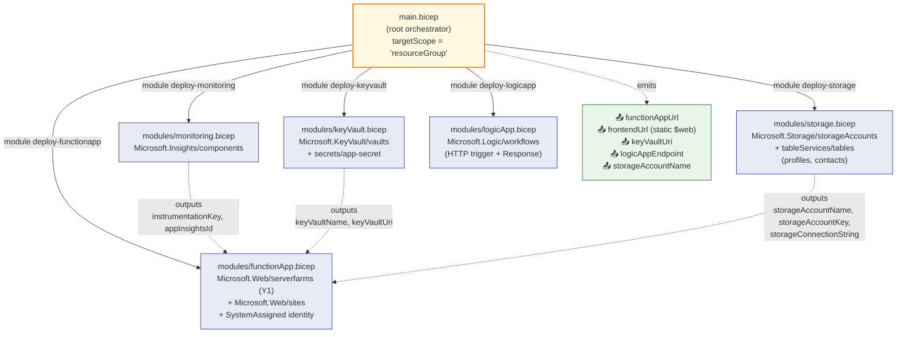
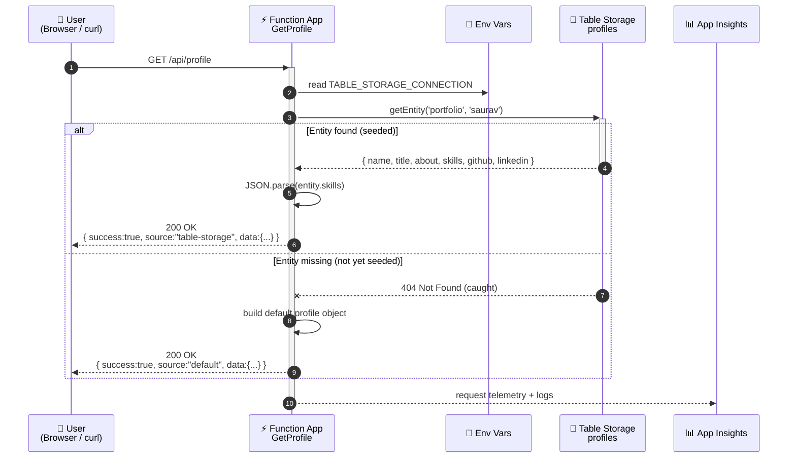
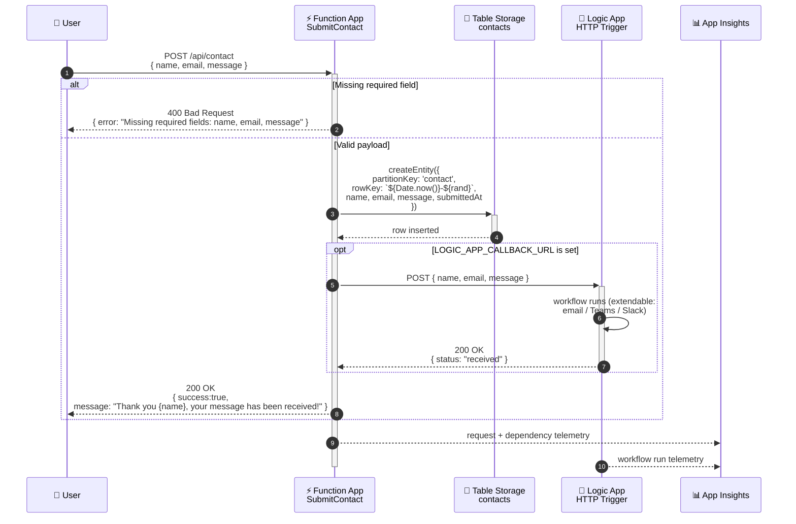

# Student Portfolio Platform — Azure Bicep IaC Project

> A beginner-friendly, end-to-end **serverless cloud project** for Microsoft Azure, built entirely with **Infrastructure as Code (Bicep)** and a handful of PowerShell scripts.
> Runs on free / consumption tiers — total cost for a deploy → test → destroy cycle: **~$0.00** with the Azure for Students subscription.

---

## 📑 Table of Contents

1. [What is this project?](#-what-is-this-project)
2. [Concepts in plain English](#-concepts-in-plain-english)
3. [Architecture overview](#%EF%B8%8F-architecture-overview)
4. [Resources deployed](#-resources-deployed-what-each-one-is-and-why-its-here)
5. [Repository layout (file-by-file)](#-repository-layout-file-by-file)
6. [Bicep module graph](#-bicep-module-graph)
7. [Communication flows](#-communication-flows-end-to-end)
   - [GET /api/profile](#1-get-apiprofile--read-flow)
   - [POST /api/contact](#2-post-apicontact--write--notify-flow)
   - [Frontend → API](#3-frontend--api-flow)
   - [Key Vault reference resolution](#4-key-vault-reference-resolution-startuprefresh)
8. [Deployment pipeline](#-deployment-pipeline-deployps1)
9. [Quick start](#-quick-start)
10. [Testing](#-testing)
11. [Destroy / cleanup](#-destroy--stop-all-charges)
12. [Bicep concepts covered](#-bicep-concepts-covered)
13. [Cost model](#-cost-model)
14. [Troubleshooting](#-if-something-breaks-common-gotchas)
15. [What you'll learn](#-what-youll-learn-by-reading--running-this)
16. [References](#-references)

---

---

## 📖 What is this project?

This project is a tiny but **complete cloud application** for a personal portfolio website. It's designed as a **learning project** — you can read every file, understand every Azure service involved, deploy it to your own subscription in ~5 minutes, play with it, then tear it down so it costs you nothing.

Imagine the backend of a portfolio site like `yourname.dev` — it needs to:

1. **Serve your profile** (name, bio, skills, links) to whoever visits the page.
2. **Accept messages** from a "Contact Me" form and store them safely.
3. **Notify you** when someone gets in touch.
4. **Store secrets** (API keys, passwords) without hard-coding them.
5. **Tell you** when something breaks.

That's exactly what this project builds — using five small Azure services glued together with code, plus a static HTML/JS frontend hosted in the same storage account.

### What does it actually *do*?

Once deployed, you get:

- A **static portfolio website** served from Azure Storage's `$web` container (HTTPS, free).
- A **live HTTPS API** in the cloud with two endpoints:

| Endpoint | Method | What it does |
|---|---|---|
| `/api/profile` | GET | Returns your portfolio data (name, title, about, skills, links) as JSON. |
| `/api/contact` | POST | Accepts a JSON body `{name, email, message}`, saves it to a database, and notifies a Logic App workflow. |

The frontend calls these two endpoints to power the live portfolio site. No servers to manage, no VMs to patch, no monthly bill.

### What does it *show / teach*?

This project is a hands-on tour of **modern cloud fundamentals**:

- **Infrastructure as Code (IaC)** — your cloud setup lives in Git as `.bicep` files instead of being clicked together in a portal.
- **Serverless compute** — Azure Functions runs your Node.js code only when someone calls the API (you pay per request, not per hour).
- **NoSQL storage** — Azure Table Storage as a tiny, cheap, schemaless database.
- **Static website hosting** — frontend served straight from a Storage Account at no extra cost.
- **Secrets management** — Azure Key Vault + Managed Identity, so no passwords ever sit in your code.
- **Workflow automation** — Azure Logic Apps as a low-code "if this, then that" engine.
- **Observability** — Application Insights collects logs and metrics automatically.
- **One-click deploy & destroy** — PowerShell scripts that wire everything up and tear it down.
- **Smoke testing** — an automated end-to-end test that proves your live deployment actually works.

---

## 🧠 Concepts in plain English

If any of the buzzwords below are new, here's the 30-second version:

| Term | Plain-English meaning |
|---|---|
| **Cloud** | Someone else's computers (Microsoft's, in this case) that you rent by the second. |
| **Resource Group** | A folder in Azure that holds all the resources for one project. Delete the folder → delete everything inside → bill stops. |
| **Bicep** | A friendly language for describing Azure resources. You write what you want; Azure makes it real. Replaces clicking around the portal. |
| **IaC (Infrastructure as Code)** | The idea that your cloud setup should be a file in Git, not a memory of clicks. Reproducible, reviewable, versioned. |
| **Serverless** | You write functions; the cloud runs them on demand. You don't manage a server. When nobody calls your API, you pay $0. |
| **Azure Function** | A small piece of code (here, Node.js) that runs in response to an HTTP request. |
| **Table Storage** | A super-cheap NoSQL key/value store. Think "Excel-like rows with a partition + row key". Perfect for tiny apps. |
| **Key Vault** | A secure safe for secrets (passwords, API keys, connection strings). |
| **Managed Identity** | An Azure-provided identity for your app, so it can talk to other Azure services *without* a password. The cloud handles the auth for you. |
| **Logic App** | A visual/JSON-defined workflow. "When X happens, do Y, then Z." Great for notifications, integrations, glue code. |
| **Application Insights** | Auto-collects logs, errors, response times, and request counts from your app. Your "black box recorder". |
| **Consumption / Y1 plan** | A pricing tier where you only pay per execution. Free for the first 1 million calls per month. |
| **Static Website (`$web`)** | A special blob container on a Storage Account that serves files directly over HTTPS like a CDN — no web server needed. |

---

## 🏗️ Architecture overview

End-to-end view of every component, who it talks to, and how the data flows.

```mermaid
flowchart TB
    subgraph Client["👤 Client Layer"]
        Browser["Browser / curl / Postman"]
    end

    subgraph Azure["☁️ Azure Resource Group: rg-portfolio-dev (Central India)"]
        direction TB

        subgraph Frontend["🌐 Frontend Hosting"]
            BlobWeb["Storage Account – $web container<br/>(Static Website endpoint:<br/>https://&lt;sa&gt;.z29.web.core.windows.net)"]
            StaticFiles["index.html · app.js · style.css · config.js"]
            BlobWeb --- StaticFiles
        end

        subgraph Compute["⚡ Serverless Compute"]
            Plan["App Service Plan (Y1 Dynamic)"]
            FuncApp["Function App<br/>Node.js 18<br/>System-Assigned Managed Identity<br/>GET /api/profile · POST /api/contact"]
            FuncApp -.hosted on.-> Plan
        end

        subgraph Data["💾 Storage / Data (same Storage Account as $web)"]
            StAcct["Storage Account<br/>StorageV2 · Standard_LRS · TLS1.2"]
            TableProfiles["Table: profiles<br/>PK=portfolio · RK=saurav"]
            TableContacts["Table: contacts<br/>PK=contact · RK=&lt;ts&gt;-&lt;rand&gt;"]
            StAcct --> TableProfiles
            StAcct --> TableContacts
        end

        subgraph Secrets["🔐 Secrets"]
            KV["Key Vault<br/>(RBAC, Soft-Delete 7d)"]
            Secret["Secret: app-secret"]
            KV --> Secret
        end

        subgraph Workflow["🔄 Workflow"]
            LogicApp["Logic App (Consumption)<br/>HTTP Trigger → Response 200"]
        end

        subgraph Observability["📊 Observability"]
            AppInsights["Application Insights<br/>(logs · metrics · traces · failures)"]
        end
    end

    Browser -->|HTTPS GET index.html| BlobWeb
    Browser -->|fetch /api/profile<br/>fetch /api/contact| FuncApp
    BlobWeb -.serves JS that calls.-> FuncApp

    FuncApp -->|TABLE_STORAGE_CONNECTION<br/>read 'profiles'| TableProfiles
    FuncApp -->|TABLE_STORAGE_CONNECTION<br/>write 'contacts'| TableContacts
    FuncApp -->|POST JSON payload<br/>LOGIC_APP_CALLBACK_URL| LogicApp
    FuncApp -->|@Microsoft.KeyVault reference<br/>via Managed Identity| KV
    FuncApp -->|APPINSIGHTS_<br/>INSTRUMENTATIONKEY| AppInsights
    LogicApp -.workflow run telemetry.-> AppInsights

    classDef client fill:#e3f2fd,stroke:#1565c0,color:#0d47a1
    classDef compute fill:#fff3e0,stroke:#e65100,color:#bf360c
    classDef data fill:#e8f5e9,stroke:#2e7d32,color:#1b5e20
    classDef secret fill:#fce4ec,stroke:#ad1457,color:#880e4f
    classDef workflow fill:#f3e5f5,stroke:#6a1b9a,color:#4a148c
    classDef monitor fill:#ede7f6,stroke:#4527a0,color:#311b92
    classDef frontend fill:#e0f7fa,stroke:#00838f,color:#006064

    class Browser client
    class FuncApp,Plan compute
    class StAcct,TableProfiles,TableContacts data
    class KV,Secret secret
    class LogicApp workflow
    class AppInsights monitor
    class BlobWeb,StaticFiles frontend
```

> **One subtle detail:** the same Storage Account hosts the Function App's runtime files (Azure Files share for `WEBSITE_CONTENTAZUREFILECONNECTIONSTRING`), the static website's `$web` container, **and** the two NoSQL tables. One bucket, three roles — that's why the design is the cheapest possible.

---

## 📋 Resources deployed (what each one is and why it's here)

All resources live inside one resource group (`rg-portfolio-dev`) in **Central India**.

### 1. Storage Account + Table Storage — *the database, the static host, and the Function runtime store*
- **What it is:** A general-purpose v2 Storage Account (`Standard_LRS`, TLS 1.2 minimum, HTTPS only) that hosts:
  - Two NoSQL **tables**: `profiles` (your portfolio data) and `contacts` (form submissions).
  - The **`$web`** blob container that serves the static frontend (enabled by `deploy.ps1`).
  - The **Azure Files share** that the Functions runtime uses for `WEBSITE_CONTENTAZUREFILECONNECTIONSTRING`.
- **Why it's here:** Table Storage is the cheapest persistent database in Azure (literally fractions of a cent). Static website hosting is free on top of normal blob pricing. Reusing one account for all three roles keeps the architecture (and bill) minimal.
- **Cost:** ~$0.01/month at hobby scale.
- **Defined in:** [modules/storage.bicep](modules/storage.bicep)

### 2. Azure Functions (Y1 Consumption) — *the API*
- **What it is:** A serverless Node.js 18 app exposing two HTTP endpoints (`GET /api/profile`, `POST /api/contact`).
- **Key features:**
  - **System-Assigned Managed Identity** — the App has its own Azure AD identity for talking to Key Vault without a password.
  - **CORS** allowlist (Azure portal, `localhost:3000`, and the static-site URL added by `deploy.ps1`).
  - `httpsOnly = true`, `minTlsVersion = '1.2'`, FTPS disabled.
  - Remote build during zip deploy (`SCM_DO_BUILD_DURING_DEPLOYMENT=true`, `ENABLE_ORYX_BUILD=true`) so `npm install` runs on the cloud side.
- **Why it's here:** It's the "brain" — receives HTTP requests, talks to Table Storage, calls the Logic App. Y1 plan = pay-per-execution.
- **Cost:** Free for the first **1,000,000 executions/month**.
- **Defined in:** [modules/functionApp.bicep](modules/functionApp.bicep)

### 3. Key Vault — *the safe*
- **What it is:** A managed secret store with **RBAC** authorization, soft-delete (7 days), and a single demo secret (`app-secret`) created during deployment.
- **Why it's here:** Demonstrates the production pattern of keeping secrets out of code/config files. The Function App reads it via an `@Microsoft.KeyVault(...)` reference using its Managed Identity — **no password ever touches your source code**.
- **Cost:** Free for basic operations.
- **Defined in:** [modules/keyVault.bicep](modules/keyVault.bicep)

### 4. Logic App (Consumption) — *the notifier / workflow*
- **What it is:** An HTTP-triggered workflow that the Function App POSTs to whenever a new contact is submitted. The trigger expects a JSON schema with `name`, `email`, and `message`, and currently just responds `200 OK { status: "received" }`.
- **Why it's here:** Shows how to extend an app with no-code/low-code automation. Today it just acks; you can easily extend it to send an email, post to Teams/Slack, or call any API — without touching the Function code.
- **Cost:** Free for the first ~4,000 actions/month.
- **Defined in:** [modules/logicApp.bicep](modules/logicApp.bicep)

### 5. Application Insights — *the camera*
- **What it is:** Azure's monitoring and telemetry service with a 30-day retention window.
- **Why it's here:** Captures logs, exceptions, request rates, durations, and dependencies from the Function App automatically via `APPINSIGHTS_INSTRUMENTATIONKEY`. Lets you debug a live system from the Azure portal.
- **Cost:** Free for the first 5 GB of ingested telemetry/month.
- **Defined in:** [modules/monitoring.bicep](modules/monitoring.bicep)

**Total cost for deploy → test → destroy: ~$0.00**

---

## 📂 Repository layout (file-by-file)

```
Portfolio-project/
├── main.bicep                       # Root orchestrator — wires the 5 modules together
├── deploy.ps1                       # One-click deploy: RG + Bicep + zip + frontend + seed
├── destroy.ps1                      # One-click cleanup (deletes the resource group)
├── azure-for-students-plan.md       # Offer details, limits, and credit-saving tips
├── README.md                        # ← you are here
├── modules/
│   ├── storage.bicep                # Storage Account + tableServices + profiles/contacts tables
│   ├── functionApp.bicep            # Y1 plan + Function App + Managed Identity + app settings
│   ├── keyVault.bicep               # Key Vault (RBAC, soft-delete) + the demo app-secret
│   ├── logicApp.bicep               # Consumption Logic App with HTTP trigger + Response
│   └── monitoring.bicep             # Application Insights component
├── parameters/
│   └── dev.bicepparam               # Reference parameter file (deploy.ps1 passes params inline)
├── src/
│   ├── api/                         # Node.js 18 Azure Functions app
│   │   ├── host.json                # Runtime config + App Insights sampling
│   │   ├── package.json             # @azure/data-tables ^13.2.2
│   │   ├── GetProfile/
│   │   │   ├── function.json        # HTTP trigger: GET /api/profile, anonymous
│   │   │   └── index.js             # Reads profiles/portfolio/saurav, falls back to defaults
│   │   └── SubmitContact/
│   │       ├── function.json        # HTTP trigger: POST /api/contact, anonymous
│   │       └── index.js             # Validates, writes to contacts, forwards to Logic App
│   └── frontend/                    # Static portfolio site (served from $web)
│       ├── index.html               # Hero + 2 panels (profile read, contact write)
│       ├── style.css                # Responsive design (clamp, grid, glassy panels)
│       ├── app.js                   # fetch /api/profile, POST /api/contact, renderProfile()
│       └── config.js                # Placeholder — overwritten by deploy.ps1 with apiBaseUrl
└── scripts/
    ├── seed-profile.ps1             # Inserts portfolio/saurav into the profiles table
    └── smoke-test.ps1               # 12-check end-to-end validation of the live deployment
```

### What each file does, in one line

| File | One-liner |
|---|---|
| [main.bicep](main.bicep) | Declares names, calls 5 modules, wires their outputs together, emits 5 deployment outputs. |
| [modules/storage.bicep](modules/storage.bicep) | Provisions Storage v2 + Table Service + `profiles` & `contacts` tables, exports keys & connection string. |
| [modules/functionApp.bicep](modules/functionApp.bicep) | Y1 plan + Function App with MI, all app settings (incl. `@Microsoft.KeyVault` reference), CORS, HTTPS-only. |
| [modules/keyVault.bicep](modules/keyVault.bicep) | RBAC-enabled vault + single secret `app-secret`. Outputs name & URI. |
| [modules/logicApp.bicep](modules/logicApp.bicep) | Inline JSON workflow: HTTP trigger validating `{name,email,message}` → 200 Response. |
| [modules/monitoring.bicep](modules/monitoring.bicep) | App Insights component (web kind, 30d retention). Outputs instrumentation key. |
| [parameters/dev.bicepparam](parameters/dev.bicepparam) | Sample parameter file; the real `appSecret` is injected at deploy time. |
| [src/api/host.json](src/api/host.json) | Functions runtime v4 + extension bundle + App Insights sampling. |
| [src/api/package.json](src/api/package.json) | One runtime dep: `@azure/data-tables`. |
| [src/api/GetProfile/index.js](src/api/GetProfile/index.js) | Reads entity `portfolio/saurav` from `profiles`; on miss returns default payload with `source: "default"`. |
| [src/api/SubmitContact/index.js](src/api/SubmitContact/index.js) | Validates body → inserts into `contacts` → optional POST to Logic App → returns `{success, message}`. |
| [src/frontend/index.html](src/frontend/index.html) | Markup with `#profile-name`, `#skills-list`, `#contact-form`, etc. Loads `config.js` then `app.js`. |
| [src/frontend/app.js](src/frontend/app.js) | On load → `GET /api/profile` and render; on submit → `POST /api/contact`. |
| [src/frontend/config.js](src/frontend/config.js) | Holds `window.PORTFOLIO_CONFIG.apiBaseUrl` — regenerated by `deploy.ps1`. |
| [src/frontend/style.css](src/frontend/style.css) | Glassmorphism look — Space Grotesk + Source Serif, gradients, responsive `<860px` collapse. |
| [deploy.ps1](deploy.ps1) | 6-stage one-click deploy (RG → Bicep → zip API → publish frontend → seed). |
| [destroy.ps1](destroy.ps1) | `az group delete --yes --no-wait` after typing `yes`. |
| [scripts/seed-profile.ps1](scripts/seed-profile.ps1) | Pulls storage key, ensures `profiles` table, inserts/replaces the `portfolio/saurav` entity. |
| [scripts/smoke-test.ps1](scripts/smoke-test.ps1) | 12 checks (RG, app state, settings, tables, seeded entity, GET, POST, persistence, 400). |

---

## 🧩 Bicep module graph

How `main.bicep` orchestrates the five modules and threads their outputs into the Function App.



> The Function App module has **three implicit dependencies** (Storage, Key Vault, Monitoring) — Bicep figures out the deploy order automatically from the `params:` block. The Logic App is independent and deploys in parallel.

---

## 🔁 Communication flows (end-to-end)

### 1. `GET /api/profile` — read flow



**Why the fallback matters:** if the seed step hasn't run yet (or you deleted the row), the API still returns a sensible payload instead of an error. You can tell the two apart by the `source` field.

---

### 2. `POST /api/contact` — write + notify flow



> **Note:** the Logic App's callback URL isn't wired into the Function App by Bicep today — `LOGIC_APP_CALLBACK_URL` is an optional env var. To wire it up, add an `appSettings` entry referencing `logicApp.outputs.logicAppCallbackUrl` in [modules/functionApp.bicep](modules/functionApp.bicep). The current code is **resilient** to it being absent.

---

### 3. Frontend → API flow

```mermaid
sequenceDiagram
    autonumber
    participant U as 👤 Browser
    participant W as 🌐 Storage $web<br/>(static site)
    participant J as 📜 app.js (runs in browser)
    participant API as ⚡ Function App API

    U->>W: GET https://&lt;sa&gt;.z29.web.core.windows.net/
    W-->>U: index.html + style.css + config.js + app.js

    Note over U,J: Browser parses HTML,<br/>loads config.js then app.js
    J->>J: read window.PORTFOLIO_CONFIG.apiBaseUrl
    J->>+API: GET {apiBaseUrl}/api/profile
    API-->>-J: { success, source, data }
    J->>J: renderProfile() → name, title, about, skills, github

    U->>J: submits #contact-form
    J->>+API: POST {apiBaseUrl}/api/contact<br/>{ name, email, message }
    API-->>-J: { success, message }
    J->>U: update #form-status pill
```

> **CORS** is configured in [modules/functionApp.bicep](modules/functionApp.bicep) (`allowedOrigins` defaults to `portal.azure.com` and `localhost:3000`); `deploy.ps1` appends the live static-site URL with `az functionapp cors add`.

---

### 4. Key Vault reference resolution (startup/refresh)

How the Function App reads `app-secret` from Key Vault **without ever seeing a password** in source code.

```mermaid
sequenceDiagram
    autonumber
    participant F as ⚡ Function App<br/>(System-Assigned MI)
    participant AAD as 🛡️ Azure AD<br/>(IMDS endpoint)
    participant KV as 🔐 Key Vault<br/>(RBAC enabled)
    participant App as 📦 App Settings<br/>(APP_SECRET)

    Note over F,App: At Function App startup / setting refresh
    F->>App: read APP_SECRET =<br/>@Microsoft.KeyVault(VaultName=...;SecretName=app-secret)
    App->>+AAD: request token<br/>(resource=https://vault.azure.net)
    AAD-->>-App: AAD access token<br/>(scoped to the App's MI principal)
    App->>+KV: GET /secrets/app-secret<br/>Authorization: Bearer &lt;token&gt;
    KV->>KV: RBAC check<br/>(MI must have "Key Vault Secrets User")
    KV-->>-App: secret value
    App-->>F: resolved env var APP_SECRET=&lt;value&gt;
    Note over F: Function code reads<br/>process.env.APP_SECRET<br/>— no credential in source
```

> **Heads-up (one thing the Bicep does *not* do today):** the Function App's Managed Identity is created, but the RBAC role assignment giving it `Key Vault Secrets User` on the vault is **not** present in [modules/keyVault.bicep](modules/keyVault.bicep). If you rely on `APP_SECRET` at runtime, add a `Microsoft.Authorization/roleAssignments` resource granting the MI's principal ID that role — otherwise the reference resolves to an unresolved placeholder. The rest of the app does not depend on this secret today, so it remains a teaching example.

---

## 🚀 Deployment pipeline (`deploy.ps1`)

The one-click deployment is a 6-stage pipeline. Each stage is idempotent — re-running is safe.

```mermaid
flowchart LR
    Dev["👨‍💻 Developer<br/>(PowerShell)"] -->|"./deploy.ps1"| Script

    subgraph Script["deploy.ps1 — 6 stages"]
        direction TB
        S1["[1/6] az group create<br/>rg-portfolio-dev · centralindia"]
        S2["[2/6] az deployment group create<br/>main.bicep + appSecret"]
        S3["[3/6] Capture outputs:<br/>funcUrl · frontendUrl ·<br/>kvUri · storageName"]
        S4["[4/6] Compress src/api → zip<br/>az functionapp deployment<br/>source config-zip<br/>(remote npm install via Oryx)"]
        S5["[5/6] Enable $web static site<br/>Inject config.js (apiBaseUrl)<br/>az storage blob upload-batch<br/>az functionapp cors add"]
        S6["[6/6] scripts/seed-profile.ps1<br/>az storage entity insert<br/>(profiles/portfolio/saurav)"]
        S1 --> S2 --> S3 --> S4 --> S5 --> S6
    end

    S2 -->|ARM deploys| Bicep
    subgraph Bicep["main.bicep modules"]
        M1["monitoring.bicep<br/>App Insights"]
        M2["keyVault.bicep<br/>KV + app-secret"]
        M3["storage.bicep<br/>Storage + 2 tables"]
        M4["functionApp.bicep<br/>Plan + Function App"]
        M5["logicApp.bicep<br/>Workflow"]
        M3 -.storageKey + connStr.-> M4
        M1 -.instrumentationKey.-> M4
        M2 -.kvName.-> M4
    end

    Bicep --> Azure["☁️ Azure<br/>rg-portfolio-dev"]
    S4 -->|zip + Kudu/Oryx| Azure
    S5 -->|blob REST + config update| Azure
    S6 -->|Table REST API| Azure

    Azure -->|live URLs| Dev

    classDef stage fill:#fff3e0,stroke:#e65100
    classDef bicep fill:#e8eaf6,stroke:#283593
    classDef cloud fill:#e0f7fa,stroke:#006064
    class S1,S2,S3,S4,S5,S6 stage
    class M1,M2,M3,M4,M5 bicep
    class Azure cloud
```



### Stage details

| # | Stage | What actually happens |
|---|---|---|
| 1 | **RG create** | `az group create -n rg-portfolio-dev -l centralindia` |
| 2 | **Bicep deploy** | `az deployment group create --template-file main.bicep --parameters projectName=portfolio appSecret=<prompted>` |
| 3 | **Capture outputs** | Parses `properties.outputs.{functionAppUrl, frontendUrl, keyVaultUri, logicAppEndpoint, storageAccountName}`. |
| 4 | **Publish API** | `Compress-Archive src/api/* → temp.zip` then `az functionapp deployment source config-zip --build-remote true`. Kudu runs Oryx → `npm install` on the cloud. |
| 5 | **Publish frontend** | Enables `$web` static site, writes a generated `config.js` with `apiBaseUrl=<funcUrl>`, uploads `src/frontend/*` to `$web`, adds the static-site URL to the Function App's CORS allowlist. |
| 6 | **Seed profile** | `scripts/seed-profile.ps1` resolves the storage account from the function's `TABLE_STORAGE_CONNECTION`, ensures the `profiles` table exists, and upserts the `portfolio/saurav` entity. Then calls `GET /api/profile` to prove it works. |

---

## 🛫 Quick start

### Prerequisites

- **Azure CLI** installed (`az --version`) and logged in (`az login`)
- **Azure for Students** (or any) subscription active (`az account set --subscription <id>`)
- **PowerShell 5.1+** (Windows) — used by `deploy.ps1` / `destroy.ps1` / `scripts/*`
- *(Optional)* Node.js 18+ and Azure Functions Core Tools (`npm i -g azure-functions-core-tools@4`) — only needed for **local** Function App development. `deploy.ps1` publishes via `az` zip-deploy, so they aren't required for cloud deployment.

### Deploy (one command)

```powershell
cd Portfolio-project
.\deploy.ps1
```

The script will:
1. Ask for an app secret (stored in Key Vault)
2. Create the resource group in Central India
3. Deploy all Bicep resources (~2-3 minutes)
4. Package `src/api` and publish it to the Function App (zip-deploy with remote `npm install`)
5. Enable static-site hosting and publish `src/frontend` to `$web` (with a generated `config.js`)
6. Add the static-site URL to the Function App's CORS allowlist
7. Seed your profile data into Table Storage
8. Print API & frontend URLs for testing

### Re-deploy only the function code

`deploy.ps1` already publishes the function code. Use this only if you change `src/api` and want to re-deploy quickly without re-running Bicep:

```powershell
cd src\api
func azure functionapp publish <function-app-name>
```

---

## 🧪 Testing

### Manual smoke test

Replace `<function-app-name>` with the name printed by `deploy.ps1` (looks like `portfolio-func-xxxxxxxxxxxx`).

```powershell
# Get profile
curl https://<function-app-name>.azurewebsites.net/api/profile

# Submit contact form
curl -X POST https://<function-app-name>.azurewebsites.net/api/contact `
  -H "Content-Type: application/json" `
  -d '{"name":"Test User","email":"test@example.com","message":"Hello from curl!"}'
```

**Example `GET /api/profile` response:**

```json
{
  "success": true,
  "source": "table-storage",
  "data": {
    "name": "Saurav Ganguly",
    "title": "Cloud Engineering Student",
    "about": "Learning cloud infrastructure with Azure for Students...",
    "skills": ["Azure", "Bicep", "IaC", "DevOps", "Python", "Node.js"],
    "github": "https://github.com/ganguly298",
    "linkedin": ""
  }
}
```

**Example `POST /api/contact` response:**

```json
{
  "success": true,
  "message": "Thank you Test User, your message has been received!"
}
```

If the `profiles` table hasn't been seeded yet, the API gracefully falls back to default data and returns `"source": "default"`.

### Automated end-to-end smoke test

```powershell
.\scripts\smoke-test.ps1
```

Runs **12 checks**:

1. Resource group exists
2. Function App state = Running
3. `TABLE_STORAGE_CONNECTION` app setting present
4. Connection string points to the expected storage account
5. `AzureWebJobsStorage` app setting present
6. Storage account key fetched
7. `profiles` table exists
8. `contacts` table exists
9. Seed entity `portfolio/saurav` exists
10. `profile.skills` is a valid JSON array
11. `GET /api/profile` returns 200 + `source=table-storage` + non-empty skills array
12. `POST /api/contact` returns success **and** the row is persisted **and** missing-field POST returns 400

Exit code = number of failed checks.

---

## 🧹 Destroy / stop all charges

```powershell
.\destroy.ps1
```

Prompts for `yes`, then runs `az group delete --yes --no-wait`. Resources disappear in the background (2–5 min). Once deletion completes, **no further charges accrue**.

> ⚠️ Key Vault names are soft-deleted for 7 days. If you re-deploy with the same `projectName`, you may need to purge the old vault first, change the name, or wait 7 days.

---

## 🎓 Bicep concepts covered

| Concept | Where |
|---------|-------|
| `param` / `var` / `output` | All files |
| `@secure()` decorator | `main.bicep` (`appSecret`), `keyVault.bicep`, `functionApp.bicep` (`storageAccountKey`) |
| `@description()` decorator | Every param in every module |
| `uniqueString(resourceGroup().id)` | Globally unique resource names in `main.bicep` |
| `module` references with output threading | `main.bicep` → 5 modules |
| `targetScope = 'resourceGroup'` | `main.bicep` |
| System-Assigned **Managed Identity** | `functionApp.bicep` (`identity: { type: 'SystemAssigned' }`) |
| **Key Vault references** in app settings | `@Microsoft.KeyVault(VaultName=...;SecretName=app-secret)` in `functionApp.bicep` |
| **RBAC** Key Vault | `enableRbacAuthorization: true` in `keyVault.bicep` |
| Table Storage provisioning | `storage.bicep` (parent/child resource chain) |
| Logic App inline workflow definition | `logicApp.bicep` (`definition: { ... }`) |
| `listKeys()` & `listCallbackUrl()` runtime functions | `storage.bicep`, `logicApp.bicep` |
| Implicit dependencies via symbolic names | `main.bicep` outputs → `functionApp.bicep` params |
| CORS configuration | `functionApp.bicep` (`siteConfig.cors.allowedOrigins`) |
| HTTPS-only / TLS 1.2 / FTPS disabled | `functionApp.bicep`, `storage.bicep` |
| Static website hosting on Storage | Enabled imperatively by `deploy.ps1` (no first-class Bicep resource) |

---

## 💰 Cost model

| Scenario | Cost |
|----------|------|
| Deploy + test + destroy in one sitting | ~$0.00 |
| Leave running for a week with no traffic | ~$0.01 |
| 1,000 API calls in a day | ~$0.00 (well within free tier) |
| 10,000 contact-form submissions in a month | ~$0.00 (Functions Y1 + Table writes + Logic App free tiers) |

> 💡 The Azure for Students subscription gives you **$100 in free credit** for 12 months and doesn't require a credit card. See [`azure-for-students-plan.md`](./azure-for-students-plan.md) for the full breakdown.

---

## 🧪 If something breaks (common gotchas)

| Symptom | Likely cause / fix |
|---|---|
| `deploy.ps1` errors with "Please run 'az login'" | Run `az login`, then re-run the script. |
| Deployment succeeds but `/api/profile` returns `"source": "default"` | The seed step didn't run or hadn't finished — re-run `scripts\seed-profile.ps1`. |
| `func: command not found` | You only need Functions Core Tools for *local* development. `deploy.ps1` doesn't use it. |
| Function App returns 500 errors | Open the resource in the Azure portal → **Application Insights** → **Failures**. Look at the latest exception. |
| `GET /api/profile` works but `POST /api/contact` doesn't from the browser | CORS — make sure `deploy.ps1` succeeded at stage 5, or manually run `az functionapp cors add --name <fn> --resource-group rg-portfolio-dev --allowed-origins https://<sa>.z29.web.core.windows.net`. |
| Smoke test fails on "Contact row persisted" | Table writes are eventually consistent; the test waits 3s. Re-run if you see a transient miss. |
| `az` CLI not on `PATH` in scripts | The PowerShell scripts use the default Windows install path (`C:\Program Files\Microsoft SDKs\Azure\CLI2\wbin\az.cmd`). Edit the `$az` variable if yours differs. |
| Key Vault deployment fails with soft-delete name conflict | Names are reused across deletes for 7 days. Wait, purge the vault, or change `projectName`. |
| `APP_SECRET` env var resolves to literal `@Microsoft.KeyVault(...)` | The Function App's Managed Identity is missing the `Key Vault Secrets User` RBAC role on the vault (see note in [Key Vault reference flow](#4-key-vault-reference-resolution-startuprefresh)). |
| Frontend loads but profile says "Missing API base URL" | `config.js` wasn't regenerated. Re-run `deploy.ps1` (stage 5) or manually edit `config.js` in `$web` to set `apiBaseUrl`. |

---

## 🎯 What you'll learn by reading & running this

By the time you've deployed, tested, and destroyed this project once, you'll have hands-on experience with:

- ✅ Writing and deploying **Bicep modules** that compose a real multi-service app
- ✅ Threading **module outputs** between modules without naming gymnastics
- ✅ Using **Azure CLI** (`az`) to log in, deploy templates, inspect resources, and seed data
- ✅ The **serverless model** with Azure Functions (HTTP triggers, app settings, env vars, Oryx remote build)
- ✅ A simple **NoSQL data model** in Azure Table Storage (partition key / row key)
- ✅ Storing and **referencing secrets** from Key Vault using Managed Identity — no passwords in code
- ✅ Building a tiny **HTTP-triggered Logic App workflow** with a JSON schema
- ✅ Hosting a **static frontend** on Storage `$web` with HTTPS for free
- ✅ Configuring **CORS** between a static site and a Function App
- ✅ Reading **logs and exceptions** in Application Insights
- ✅ Writing **PowerShell automation** for deploy / seed / smoke-test / destroy
- ✅ **Cost-aware** cloud development on a student budget

That's the foundation for almost any real cloud project — scaled down to something you can fully understand in an afternoon.

---

## 📚 References

- [Bicep Documentation](https://learn.microsoft.com/en-us/azure/azure-resource-manager/bicep/)
- [Azure Functions — Node.js Developer Guide](https://learn.microsoft.com/en-us/azure/azure-functions/functions-reference-node)
- [Azure Table Storage Overview](https://learn.microsoft.com/en-us/azure/storage/tables/table-storage-overview)
- [Static Website Hosting on Azure Storage](https://learn.microsoft.com/en-us/azure/storage/blobs/storage-blob-static-website)
- [Key Vault References in App Settings](https://learn.microsoft.com/en-us/azure/app-service/app-service-key-vault-references)
- [Logic Apps — Consumption Pricing](https://azure.microsoft.com/en-us/pricing/details/logic-apps/)
- [Application Insights for Azure Functions](https://learn.microsoft.com/en-us/azure/azure-functions/functions-monitoring)
- [Azure for Students](https://azure.microsoft.com/en-us/pricing/offers/ms-azr-0170p/)

