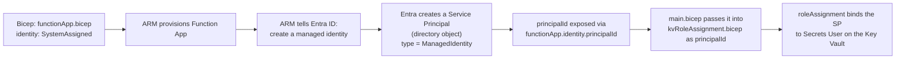

# `kvRoleAssignment.bicep` — The Story of the Locked Cupboard

> The Function App and the Key Vault

Imagine your Function App is a **new student** who just joined a school called **Azure**. The school has a **locked cupboard** (the Key Vault) where important things like passwords are kept safe.

---

## Scene 1 — The student needs an ID card

When the student joins, the principal (Azure Resource Manager) tells the office:

> "This new student needs an ID card."

You wrote that instruction in one tiny line of Bicep in `functionApp.bicep`:

```bicep
identity: { type: 'SystemAssigned' }
```

That's it. The school's central records department (**Entra ID**, formerly Azure AD) automatically creates an ID card for the Function App. The card has a unique number — the **principalId** (also called objectId). The student didn't make the card. The school made it. The student just *asked* for one by being born with `SystemAssigned: true`.

This ID card is called a **Service Principal** — the formal word for *"an ID card belonging to a robot or app instead of a human."*

---

## Scene 2 — The ID card is useless on its own

The student has an ID, but if they walk to the locked cupboard, the guard (Key Vault) refuses:

> "Cool ID, kid. But your name isn't on my visitor list."

The cupboard cares **what you're allowed to do**, not who you are. So we add the student's name to the guard's list with a specific permission: *"can read secrets, cannot change them."*

---

## Scene 3 — Writing the permission slip

That permission slip is the **roleAssignment** resource — a tiny form with exactly three blanks:

| Blank | School analogy | Bicep field |
|---|---|---|
| **Who?** | Student's ID number | `principalId` |
| **What can they do?** | "Read secrets" (a pre-printed stamp) | `roleDefinitionId` |
| **Where does it apply?** | "Only this one cupboard" | `scope` |

```bicep
resource roleAssignment 'Microsoft.Authorization/roleAssignments@2022-04-01' = {
  scope: keyVault                                           // ← WHERE
  name:  guid(keyVault.id, principalId, secretsUserRoleId)  // ← deterministic name
  properties: {
    principalId:      principalId                           // ← WHO
    principalType:    'ServicePrincipal'                    // ← kind of identity
    roleDefinitionId: subscriptionResourceId(               // ← WHAT
                        'Microsoft.Authorization/roleDefinitions',
                        secretsUserRoleId)
  }
}
```

### Field-by-field

| Field | Why it looks like that |
|---|---|
| `'Microsoft.Authorization/roleAssignments@2022-04-01'` | RBAC is a sub-resource of *any* Azure resource, so the type is always the same. |
| `scope: keyVault` | The role applies to this specific vault only. Could be RG, subscription, or single secret instead. `keyVault` is the `existing` reference declared above. |
| `name: guid(scope.id, principalId, roleDefId)` | Role assignment names **must be GUIDs**. `guid(...)` of three stable inputs makes it deterministic → re-running Bicep is idempotent. |
| `principalId` | The **objectId** of the identity in Entra ID. For a system-assigned MI, this is `functionApp.identity.principalId`. |
| `principalType: 'ServicePrincipal'` | Required hint. Without it the assignment can fail with transient "PrincipalNotFound" because ARM tries to validate against Entra before the MI is fully propagated. Setting `ServicePrincipal` tells ARM "trust me, skip the lookup." |
| `roleDefinitionId` | Full ARM ID of the role. `subscriptionResourceId(...)` expands the GUID `4633458b-...` into `/subscriptions/<sub>/providers/Microsoft.Authorization/roleDefinitions/4633458b-...`. The GUID `4633458b-17de-408a-b874-0445c86b69e6` is the **built-in "Key Vault Secrets User"** role. |

---

## Scene 4 — Where is the service principal created?

**You never create it explicitly.** Azure creates it for you when you set `identity: { type: 'SystemAssigned' }` on the Function App.



In `main.bicep`:

```bicep
module func 'modules/functionApp.bicep' = { ... }   // creates the MI

module kvRole 'modules/kvRoleAssignment.bicep' = {
  params: {
    keyVaultName: kv.outputs.keyVaultName
    principalId:  func.outputs.functionAppPrincipalId   // ← the SP objectId
  }
}
```

---

## Scene 5 — Why `'ServicePrincipal'` and not `'ManagedIdentity'`?

The RBAC API only knows three principal types: `User`, `Group`, `ServicePrincipal`. A managed identity is a **flavour of** service principal in Entra. On the form you still tick the `ServicePrincipal` box.

---

## The 5-Second Mental Model (Story Edition)

1. **Birth certificate** → write `identity: SystemAssigned` on the Function App. Azure secretly creates an Entra service principal. Its ID is exposed as `<resource>.identity.principalId`.
2. **Permission slip** → write a `roleAssignment` with three blanks: *who* (principalId), *what* (roleDefinitionId), *where* (scope).
3. **Unique serial number** → use `guid(those three things)` so deploying twice doesn't cause duplicates.
4. **Tick the robot box** → `principalType: 'ServicePrincipal'`.
5. **The cupboard now opens for the student.** Function App can read the Key Vault secret.

That same five-step story plays out for every other lock in your project — Blob, Queue, Table. Same student, same ID card, different cupboards, different permission slips. One pattern, copy-paste forever.
